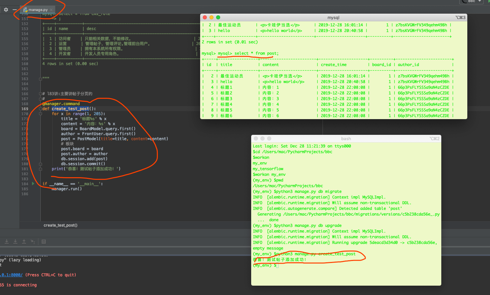
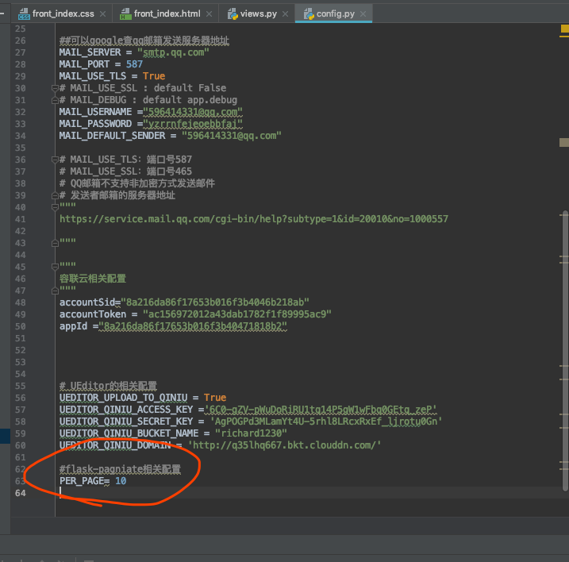
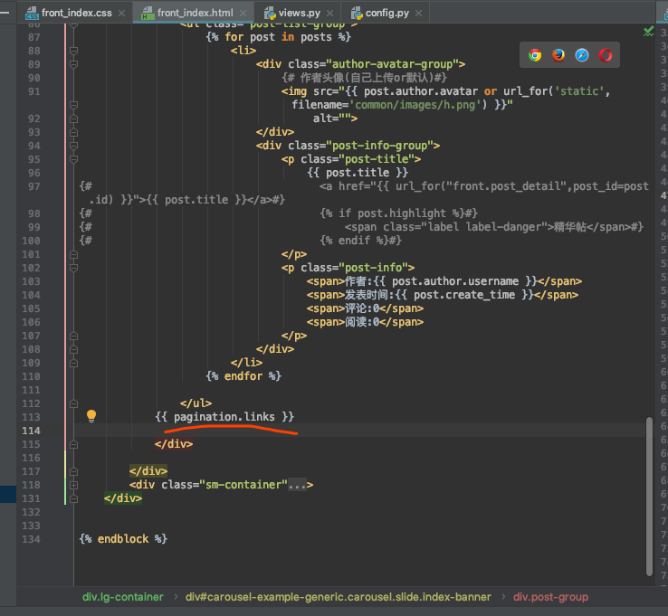
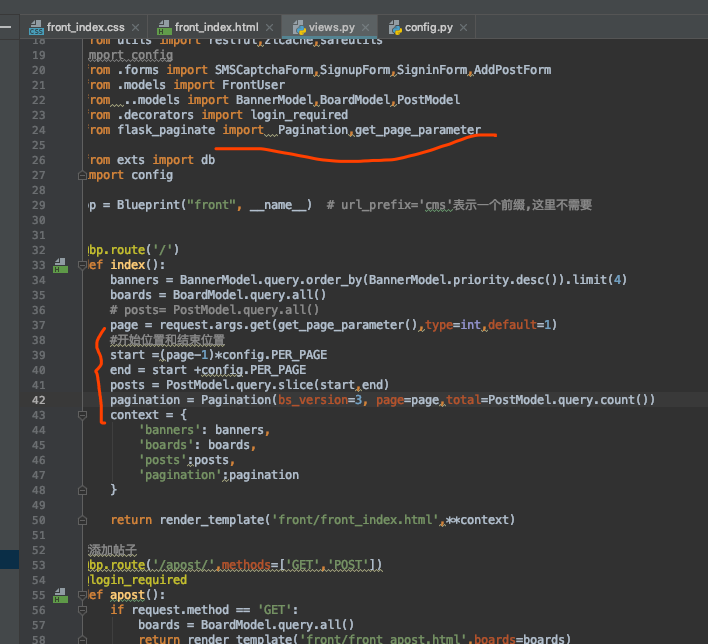
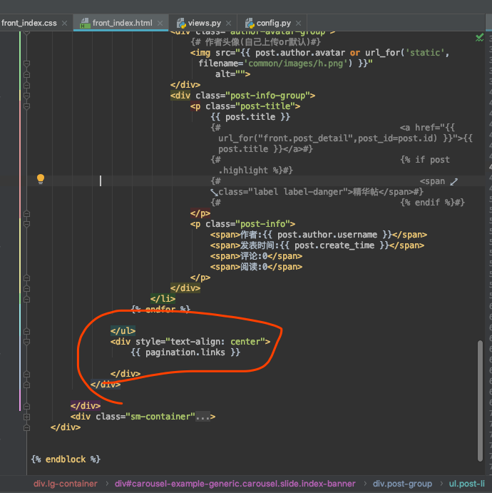
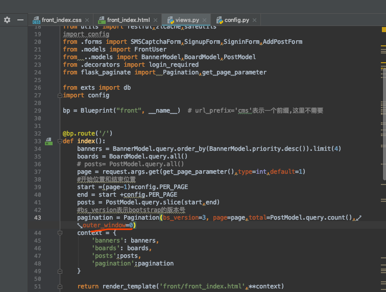
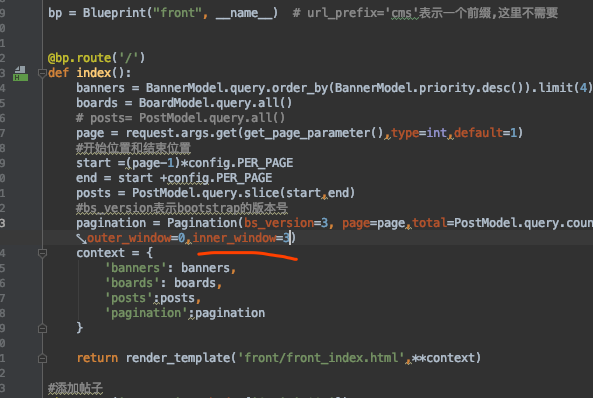
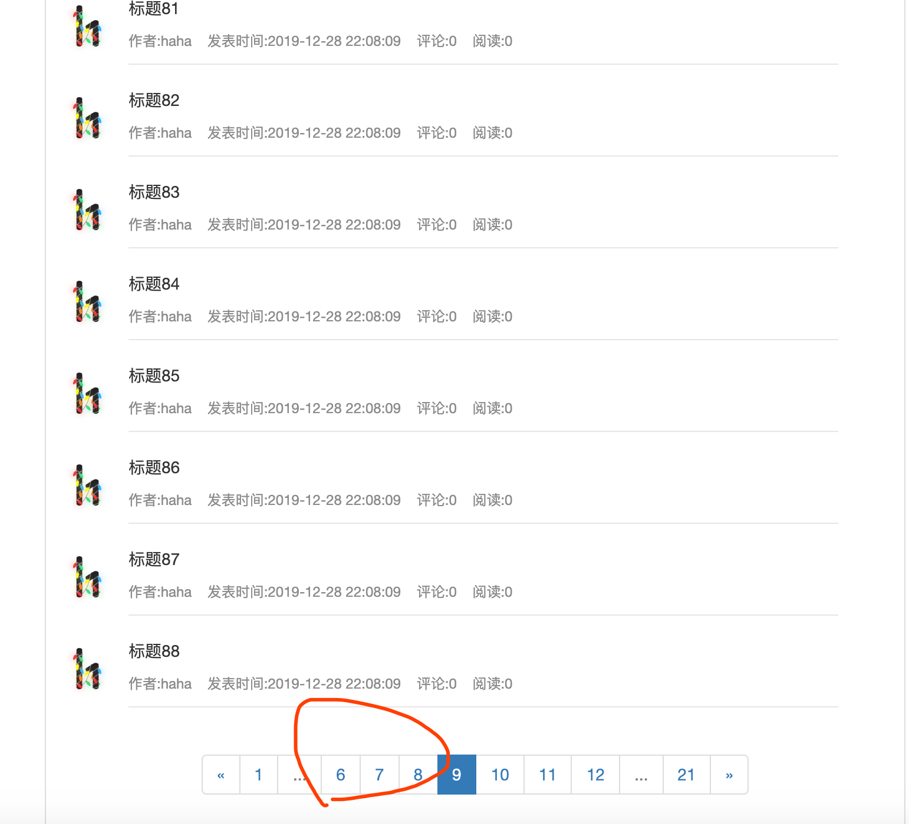

[TOC]




```
(my_env) $pip3 install flask-paginate
Collecting flask-paginate
  Downloading https://files.pythonhosted.org/packages/a2/5a/133899485b67440d0bddbead5f90191f9bbb3c60b600dbddd184f85c2c1a/flask_paginate-0.5.5-py2.py3-none-any.whl
Requirement already satisfied: Flask in /Users/mac/.virtualenvs/my_env/lib/python3.7/site-packages (from flask-paginate) (1.1.1)
Requirement already satisfied: click>=5.1 in /Users/mac/.virtualenvs/my_env/lib/python3.7/site-packages (from Flask->flask-paginate) (7.0)
Requirement already satisfied: Jinja2>=2.10.1 in /Users/mac/.virtualenvs/my_env/lib/python3.7/site-packages (from Flask->flask-paginate) (2.10.3)
Requirement already satisfied: itsdangerous>=0.24 in /Users/mac/.virtualenvs/my_env/lib/python3.7/site-packages (from Flask->flask-paginate) (1.1.0)
Requirement already satisfied: Werkzeug>=0.15 in /Users/mac/.virtualenvs/my_env/lib/python3.7/site-packages (from Flask->flask-paginate) (0.16.0)
Requirement already satisfied: MarkupSafe>=0.23 in /Users/mac/.virtualenvs/my_env/lib/python3.7/site-packages (from Jinja2>=2.10.1->Flask->flask-paginate) (1.1.1)
Installing collected packages: flask-paginate
Successfully installed flask-paginate-0.5.5
```




https://pythonhosted.org/Flask-paginate/




 


只显示1个






